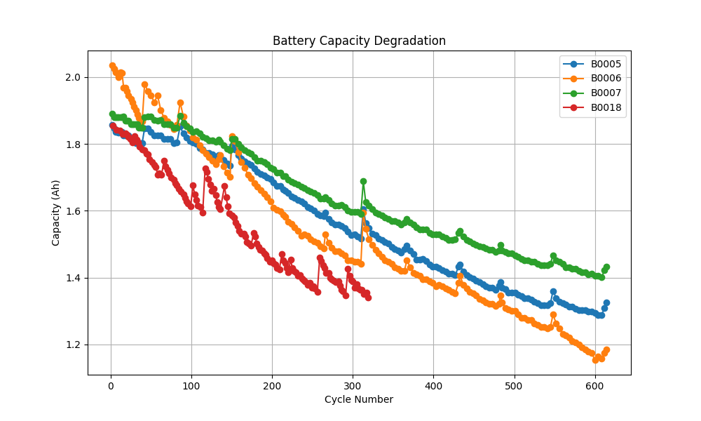
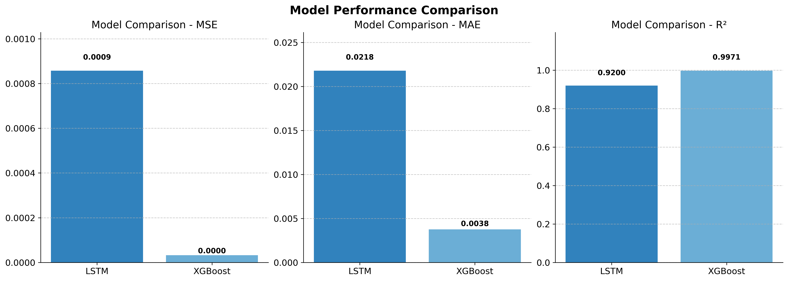
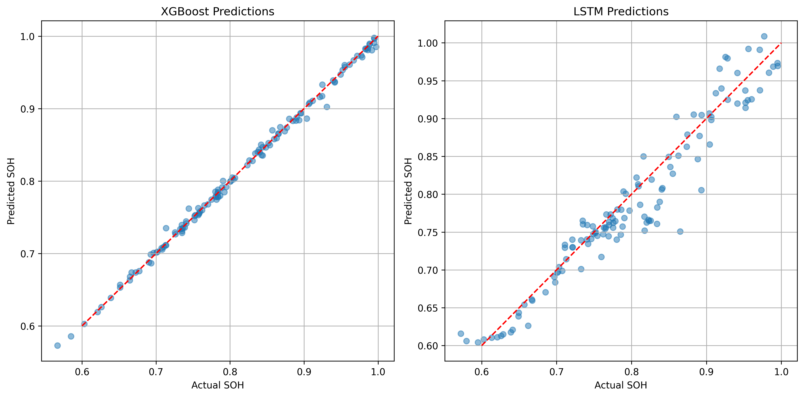

# Battery Performance Prediction

This project implements machine learning models to predict critical battery performance metrics (State of Charge and State of Health) using NASA's lithium-ion battery dataset.

## Project Overview

The project analyzes battery cycling data to predict degradation patterns and performance metrics using both deep learning (LSTM) and traditional machine learning (XGBoost) approaches. The implementation enables accurate estimation of battery health, which is crucial for battery management systems in various applications.

## Dataset

The project uses NASA's battery dataset, which contains cycling data for lithium-ion batteries running to failure under different operational conditions. The dataset includes measurements such as voltage, current, temperature, and capacity for each charge-discharge cycle.

To obtain the dataset, follow the instructions in the [data/README.md](data/README.md) file.

## Project Structure

```
battery-prediction/
│
├── data/                    # Data directory
│   └── README.md            # Instructions for downloading data
│
├── notebooks/               # Jupyter notebooks
│   ├── battery_data_analysis.ipynb   # Data exploration and feature engineering
│   └── battery_prediction.ipynb      # Model training and evaluation
│
├── models/                  # Saved model files
│
├── utils/                   # Utility functions
│   ├── __init__.py
│   ├── data_loader.py       # Functions to load and preprocess data
│   └── plotting.py          # Visualization functions
│
├── requirements.txt         # Project dependencies
├── README.md                # Project documentation
└── LICENSE                  # License file
```

## Installation

1. Clone this repository:
   ```
   git clone https://github.com/username/battery-prediction.git
   cd battery-prediction
   ```

2. Create and activate a virtual environment (optional but recommended):
   ```
   python -m venv venv
   source venv/bin/activate  # On Windows: venv\Scripts\activate
   ```

3. Install dependencies:
   ```
   pip install -r requirements.txt
   ```

4. Download the dataset following instructions in `data/README.md`

## Usage

The project workflow is organized in two Jupyter notebooks:

1. **battery_data_analysis.ipynb**:
   - Loads and preprocesses the NASA battery dataset
   - Performs exploratory data analysis
   - Extracts relevant features
   - Prepares data for model training

2. **battery_prediction.ipynb**:
   - Implements LSTM model for sequence-based prediction
   - Implements XGBoost model for tabular data prediction
   - Evaluates and compares model performance
   - Visualizes prediction results

To run the notebooks:
```
jupyter notebook notebooks/battery_data_analysis.ipynb
jupyter notebook notebooks/battery_prediction.ipynb
```

## Models

The project implements two different approaches for battery performance prediction:

1. **LSTM Network**: 
   - Deep learning approach for time-series analysis
   - Captures temporal patterns in battery degradation
   - Suitable for SOC/SOH prediction with sequential data

2. **XGBoost**:
   - Gradient boosting approach for tabular data
   - Feature-based prediction using statistical battery properties
   - Excellent performance with engineered features

## Results

### Battery Capacity Degradation
The graph below shows the degradation trend of four battery units (B0005, B0006, B0007, B0018) across several cycles. As seen, the capacity decreases progressively as the number of cycles increases, which is typical of lithium-ion battery aging.



### Model Performance Comparison
Two models were evaluated for predicting battery state of health:
- **LSTM (Long Short-Term Memory) Network**
- **XGBoost (Extreme Gradient Boosting)**

Performance metrics used:
- **MSE (Mean Squared Error)**
- **MAE (Mean Absolute Error)**
- **R² Score**

The bar plots below summarize the performance. XGBoost outperforms LSTM in all metrics:



### Model Prediction Analysis
The scatter plots compare predicted vs actual SOH values for the two models:

- **Left:** XGBoost Predictions
- **Right:** LSTM Predictions

XGBoost predictions lie very close to the diagonal, indicating higher accuracy, while LSTM predictions show greater deviation from the ideal line.



### 💡 Conclusion
- Battery capacity degrades steadily over cycling, with unit B0018 showing the steepest decline.
- XGBoost significantly outperforms LSTM for SOH prediction in terms of error and fit.
- Predictive modeling is a strong tool for forecasting battery health and optimizing maintenance cycles.

## Dependencies

- Python 3.8+
- TensorFlow/Keras
- XGBoost
- Pandas/NumPy
- Matplotlib/Seaborn
- SciPy/Scikit-learn

## License

This project is licensed under the MIT License - see the LICENSE file for details.

## Acknowledgments

- NASA Prognostics Center of Excellence for providing the battery dataset
- B. Saha and K. Goebel (2007). "Battery Data Set", NASA Ames Prognostics Data Repository, NASA Ames Research Center, Moffett Field, CA.
